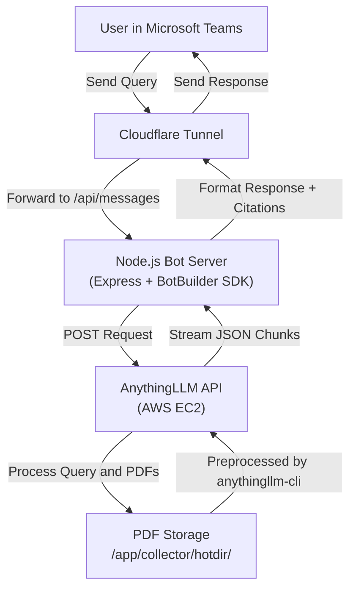

```mermaid
graph TD
    A[User in Microsoft Teams] -->|"Send Query"| B[Cloudflare Tunnel]
    B -->|"Forward to /api/messages"| C["Node.js Bot Server<br>(Express + BotBuilder SDK)"]
    C -->|"POST Request"| D["AnythingLLM API<br>(AWS EC2)"]
    D -->|"Process Query and PDFs"| E["PDF Storage<br>/app/collector/hotdir/"]
    D -->|"Stream JSON Chunks"| C
    C -->|"Format Response + Citations"| B
    B -->|"Send Response"| A
    E -->|"Preprocessed by anythingllm-cli"| D

```
